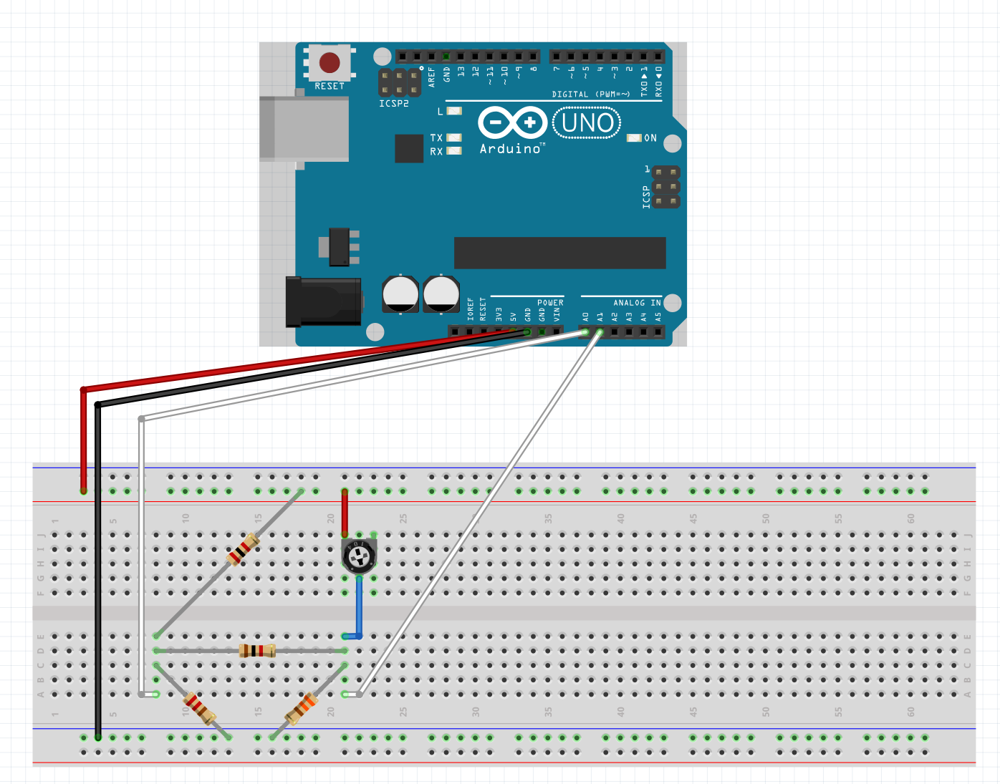
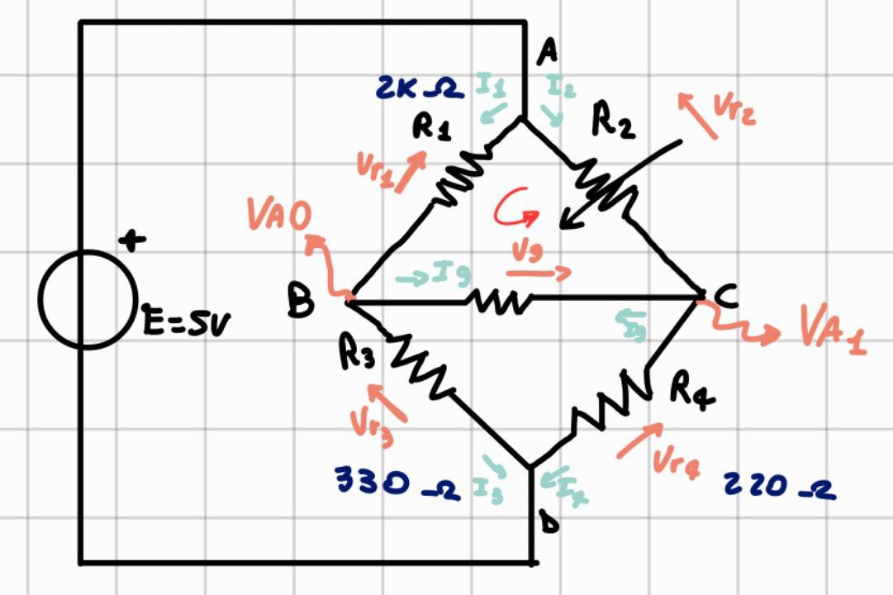

# Ponte di Wheatstone

Progetto del corso di [Fondamenti di elettrotecnica - cod 03AZHLX](https://didattica.polito.it/pls/portal30/gap.pkg_guide.viewGap?p_cod_ins=03AZHLX&p_a_acc=2025&p_header=S&p_lang=IT&multi=N) del cds triennale di Ingegneria Elettrica del [Politecnico di Torino](www.polito.it).

## Materiale utilizzato

- Arduino Uno rev3 o compatibile
- Resistore 2k
- Resistore 220
- Resistore 330
- Resistore 1k
- Potenziometro 10k
- Bredboard
- Jumpers maschio - maschio
- Usb B per il collegamento seriale al computer

## Realizzazione
Realizzare il circuito come in figura.

Caricare il codice presente all'interno di [Ponte_Wheatstone.ino](Ponte_Wheatstone.ino) sulla scheda Arduino.

Visualizzare i dati dalla porta seriale in tempo reale.

## Funzionamento

Il ponte di Wheatstone è un circuito notevole che permette di illustrare il comportamento della corrente applicando la legge di Kirkhoff delle tensioni.
In questa particolare configurazione delle resistenze otteniamo che se la produttoria delle resistenze opposte è equivalente allora la corrente passante per il "ponte" (ovvero la resistenza centrale che collega i due rami) è nulla. In questo caso specifico abbiamo una coppia di resistenze pari a $2k\Omega$ e $220\Omega$ ottenendo:

$R=2k\Omega\cdot220\Omega=440\ 000\Omega^2$

Segue che per avere corrente nulla all'interno del ponte è necessario impostare nel potenziometro una resistenza pari a:

$R_{pot}=\frac{440 000\Omega^2}{330\Omega}=1.333k\Omega$ 

Attraverso la porta seriale è possibile vedere in tempo reale sia la differenza di potenziale tra i capi del ponte, che la corrente passante, che il valore del potenziometro.

### Calcolo del valore del potenziometro

Il valore del potenziometro è stato calcolato seguendo questo schema. Possiamo usare la legge di ohm $R = \frac{V}{I}$ dove $V = 5v - Va1$ in quanto il potenziometro è collegato direttamente al generatore da 5V e ha una caduta di tensione pari a 5V meno il valore letto dal pin A1 della scheda. La corrente $I_2$ invece viene calcolata come segue:

- Con una LKC considerando come singolo nodo tutto il ponte otteniamo:

    $I_{in} = I_{out}$

    Essendo uguali gli assegnamo il nome $I_0$ .

- Con una LKC al nodo A invece:

    $I_0 = I_1 + I_2$

    Dove $I_2$ è la corrente che passa nel potenziometro. Con solo questa equazione non siamo però in grado di calcolarla.
    
- Con una LKC al nodo D:

    $I_0 = I_3 + I_4$

    In questo caso possiamo invece calcolare entrambe le correnti, infatti:

    $I_3 = \frac{Va_0}{330}$

    $I_4 = \frac{Va_1}{220}$

- Otteniamo quindi:

    $I_0 = \frac{Va_0}{330} + \frac{Va_1}{220}$

    E questa rappresenta anche la corrente che entra al nodo A, la quale si divide in due tra R1 e il potenziometro.

- Non resta che calcolare $I_1$ dato dalla caduta di tensione tra il nodo A(5V) e C(Va0)

    $I_1 = \frac{5 - Va_1}{2000}$

- E sostituire nell' equazione ottenuta al punto 2:

    $I_0 = I_1 + I_2$

    Da cui:

    $I_2 = I_0 + I_1$

    Sostituendo:

    $I_2 = (\frac{Va_0}{330} + \frac{Va_1}{220}) - \frac{5 - Va_1}{2000}$

